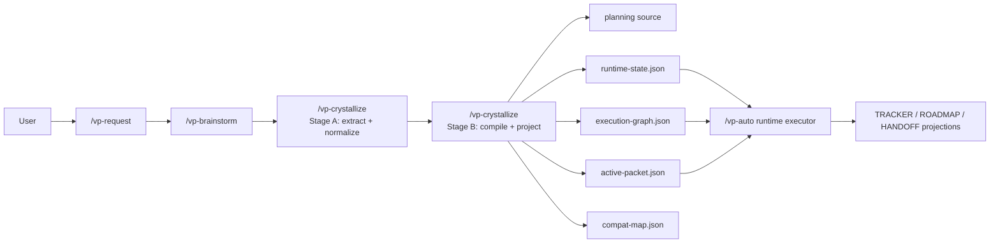
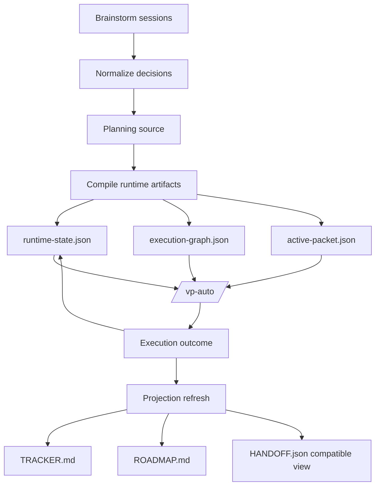
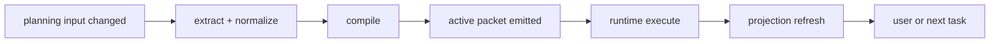
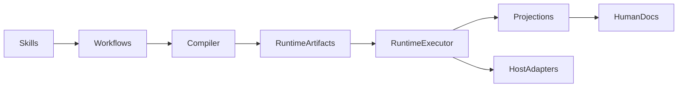
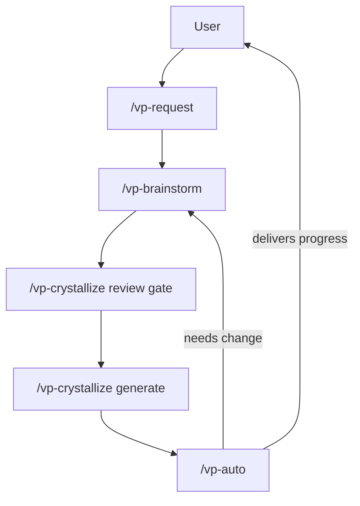

# ViePilot - Architecture

<!-- vp:consumed artifact="architecture_inputs" session="session-2026-04-04" at="2026-04-04" -->
## System Overview

ViePilot v3 is planned as a compiler-driven, state-machine-first refactor of the current local-first framework. The user-facing command journey stays intact, but `/vp-auto` is narrowed into a runtime executor that consumes compiled artifacts instead of planning prose.

The planning boundary now assumes a concrete canonical artifact, `.viepilot/planning-source.json`, which is compiled before runtime artifacts are emitted.

The runtime artifact split is explicit: `runtime-state.json` owns mutable executor truth, `execution-graph.json` owns task-level topology, and `active-packet.json` owns the narrowed current-task bundle. `compat-map.json` records how current repository artifacts map onto that v3 ownership model during the transition.

**Diagram source:** `.viepilot/architecture/system-overview.mermaid`

*No ViePilot global profile bound — organization context comes from Step 0 only.*

## Architecture Diagram Applicability

- **Complexity**: moderate
- **Services/Modules signal**: workflow compiler + runtime + projections + adapters
- **Event-driven signal**: low but non-zero because compile/projection handoffs must be explicit
- **Deployment signal**: local-first only
- **User-flow signal**: moderate because routing and review gates stay user-visible
- **Integration signal**: low, limited to host adapters and local CLI tooling

| Diagram type | Status | Reason |
|--------------|--------|--------|
| system-overview | required | Multiple major boundaries now exist: discovery, compile, runtime, projections |
| data-flow | required | The v3 thesis is fundamentally about changing data ownership and runtime truth |
| event-flows | optional | Compile and projection lifecycle transitions matter, but they are local workflow events rather than brokered messaging |
| module-dependencies | required | Clear separation between semantic workflows, compiler artifacts, runtime executor, and host adapters is essential |
| deployment | N/A | No distributed deployment target; local-first file workflow remains the model |
| user-use-case | optional | The user journey is stable but still helpful for request-to-execution reasoning |

Authoritative persisted copy: `.viepilot/SPEC.md` -> `## Diagram Applicability Matrix`.

## ViePilot organization context

No ViePilot global profile bound - organization context comes from Step 0 only.

## Services

### Discovery and Intake

- **Purpose**: Capture intent, brainstorm decisions, and planning context without committing to runtime structure too early
- **Inputs**: user requests, brainstorm sessions, existing repo state
- **Outputs**: normalized planning inputs
- **Dependencies**: `skills/`, `workflows/`, brainstorm docs

### Compiler / Planning Pipeline

- **Purpose**: Transform planning inputs into canonical structured runtime artifacts
- **Inputs**: brainstorm outputs, metadata, stack guidance, roadmap intent
- **Outputs**: `planning-source.json`, `runtime-state.json`, `execution-graph.json`, `active-packet.json`, `compat-map.json`, projections
- **Dependencies**: `.viepilot/STACKS.md`, schemas, templates

### Runtime Executor

- **Purpose**: Execute the active packet with minimal contextual rereads
- **Inputs**: runtime artifacts, active packet, task state
- **Outputs**: task execution, updated runtime state, refreshed projections
- **Dependencies**: `/vp-auto`, host adapters, git

### Runtime artifact contract split

- `runtime-state.json`: mutable executor state for mode, current packet, recovery counters, and control-point status
- `execution-graph.json`: compiler-owned task dependency graph and entry ordering
- `active-packet.json`: current-task bundle with scoped reads, writes, acceptance targets, and verification directives
- `compat-map.json`: ownership bridge from current repository artifacts to canonical planning/runtime owners and projection-only outputs
- Projections: human-facing compatibility views only; never canonical ownership

### Projection Layer

- **Purpose**: Render human-facing markdown and compatibility views from structured state
- **Inputs**: canonical runtime and planning artifacts
- **Outputs**: `TRACKER.md`, `ROADMAP.md`, `HANDOFF.json`-compatible views, logs
- **Dependencies**: templates, markdown render conventions

## Data Flow

**Diagram source:** `.viepilot/architecture/data-flow.mermaid`

`planning-source.json` is the canonical compiler input at this layer. The markdown roadmap and tracker remain human-facing projections once v3 compile is in place, while runtime-state, execution-graph, and active-packet split mutable state, topology, and actionable packet scope. `compat-map.json` makes the migration bridge explicit by classifying which current files are projections, references, or remaining canonical inputs.

### Event Flows

**Diagram source:** `.viepilot/architecture/event-flows.mermaid`

- **Status**: optional
- **Not applicable rationale**: not a brokered event system; this diagram exists only to show compile and refresh transitions.

## Module Dependencies

**Diagram source:** `.viepilot/architecture/module-dependencies.mermaid`

### User Use-Case Flows

**Diagram source:** `.viepilot/architecture/user-use-case.mermaid`

- **Status**: optional
- **Not applicable rationale**: included because routing and review remain important user-facing checkpoints.

<!-- vp:consumed artifact="architecture_inputs" session="session-2026-04-04" at="2026-04-04" -->
## Technology Decisions

| Decision | Choice | Rationale | Alternatives Considered |
|----------|--------|-----------|------------------------|
| Runtime model | State-machine-first executor | Removes prose inference from normal execution | Continue v2 prose-heavy runtime |
| Compile boundary | Two-stage crystallize pipeline | Keeps extraction reviewable before generation | Single opaque pass |
| Canonical state | Structured JSON artifacts | Better determinism and lower token cost | Markdown-only planning as source of truth |
| Planning source artifact | `planning-source.json` under `.viepilot/` | Gives compiler a single canonical upstream input before runtime artifacts exist | Continue parsing roadmap/task prose directly |
| Runtime artifact split | `runtime-state.json` + `execution-graph.json` + `active-packet.json` with non-overlapping ownership | Keeps executor state, topology, and current-task payload separated | One large runtime blob or projection-driven execution |
| Projection strategy | Generated markdown views | Preserves familiar UX without runtime drift | Manual markdown maintenance |
| Host support | Semantic workflow + thin adapters | Claude/Cursor differences stay isolated | Host-specific workflow forks |
| CLI runtime | Node.js CommonJS baseline for now | Matches current published package and bin files | Immediate ESM migration |
| Prompt library | Keep `@clack/prompts` pinned until migration is explicit | Current repo is CommonJS while current Clack docs are ESM-style | Opportunistic upgrade during v3 refactor |

## Deployment Architecture

- **Status**: N/A
- Not applicable: local-first framework, no mandatory server, no broker, no container topology.

## Monitoring & Observability

- **Logging**: git history, logs, runtime/projection state files
- **Metrics**: phase/task progress projections, test outcomes, compile verification
- **Tracing**: compile-to-runtime artifact lineage through generated files
- **Alerting**: review gates and control points rather than background infrastructure alerts
