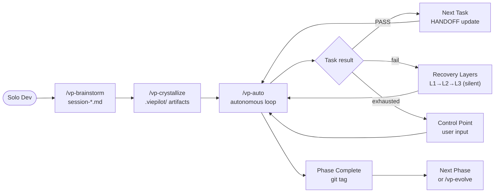
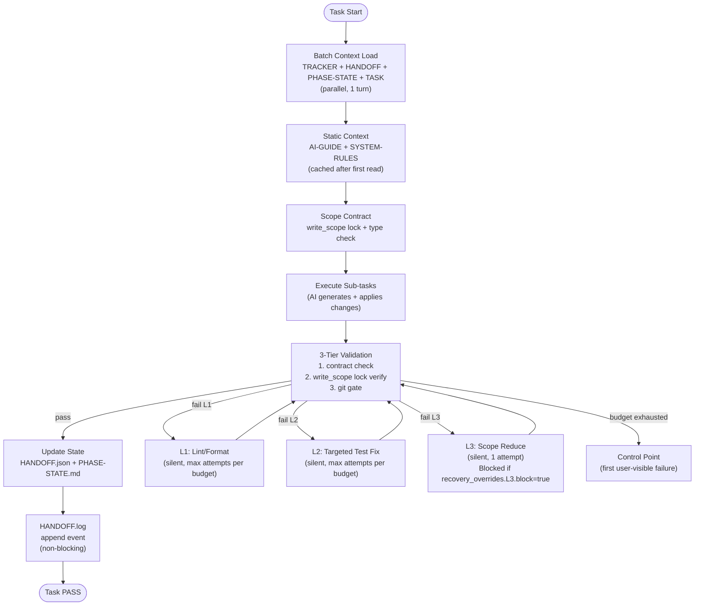
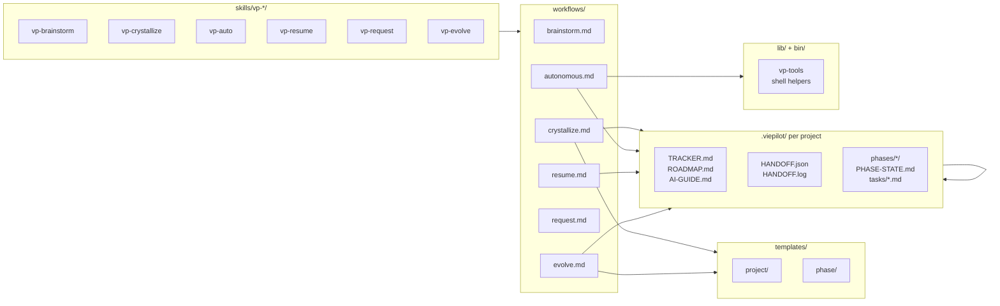

# ViePilot — Architecture

## System Overview

ViePilot là file-based AI framework — không có server, database, hay network service. Toàn bộ state được lưu trong Git-tracked files. Core loop: **brainstorm → crystallize → auto execution** với human control points.

**Diagram source:** `.viepilot/architecture/system-overview.mermaid`

*No ViePilot global profile bound — organization context comes from Step 0 only.*

## Architecture Diagram Applicability

- **Complexity**: moderate (file-based, no distributed services)
- **Services/Modules signal**: 5 logical modules (skills, workflows, templates, lib, .viepilot state)
- **Event-driven signal**: none (synchronous skill invocation; Post-MVP: background fork)
- **Deployment signal**: none (distributed as Claude Code skills, no server)
- **User-flow signal**: moderate (3-step user journey with recovery + control points)
- **Integration signal**: low (only Claude Code tool API)

| Diagram type | Status | Reason |
|---|---|---|
| system-overview | required | Core loop has 3 major components + recovery branching |
| data-flow | required | Task execution pipeline is central to v2 (recovery, validation, HANDOFF) |
| event-flows | N/A | No async events in MVP; Post-MVP fork is background only |
| module-dependencies | required | 5 modules with clear dependency direction (skills→workflows→templates→artifacts) |
| deployment | N/A | No server deployment; distributed as Claude Code skills files |
| user-use-case | optional | Covered adequately by system-overview; user journey simple |

## Module Architecture

ViePilot consists of 5 logical modules:

### vp-skills (`skills/vp-*/`)
- **Purpose**: Entry point cho Claude Code — defines skill metadata + invocation
- **Inputs**: User invocation (`/vp-*`), optional args `{{VP_ARGS}}`
- **Outputs**: Routes to workflow via `@workflow` reference
- **Dependencies**: workflows/ (references), Claude Code tool API
- **Format**: SKILL.md with frontmatter (name, description, optional paths:)
- **Constraint**: SKILL.md format giữ nguyên giữa v1→v2 (non-goal breaking change)

### vp-workflows (`workflows/`)
- **Purpose**: Process definitions — step-by-step instructions cho AI
- **Inputs**: Context từ skill invocation + `.viepilot/` state files
- **Outputs**: File mutations, git commits, user prompts
- **Dependencies**: templates/ (for crystallize), `.viepilot/` artifacts (for auto)
- **Key files**: autonomous.md, crystallize.md, brainstorm.md, request.md, evolve.md

### vp-templates (`templates/`)
- **Purpose**: Artifact scaffolding — populated by crystallize/evolve
- **Inputs**: Project metadata từ Step 0 interviews
- **Outputs**: `.viepilot/` files per project
- **Structure**: `templates/project/` (project-level), `templates/phase/` (phase/task level)

### vp-lib (`lib/`, `bin/`)
- **Purpose**: Shell utilities — tag prefix, version bump, git helpers
- **Inputs**: Shell environment
- **Outputs**: stdout, git operations
- **Key tool**: `bin/vp-tools` (tag-prefix, version bump)

### vp-state (`.viepilot/` per project)
- **Purpose**: Runtime state — all project-specific artifacts live here
- **Inputs**: crystallize (initial creation), vp-auto (continuous updates)
- **Outputs**: HANDOFF.json (position), HANDOFF.log (audit), PHASE-STATE.md (progress)
- **Critical files**: TRACKER.md, HANDOFF.json, HANDOFF.log, phases/*/PHASE-STATE.md

## Data Flow — Task Execution Pipeline

**Diagram source:** `.viepilot/architecture/data-flow.mermaid`

### Event Flows
- **Status**: N/A
- Not applicable: No async message queues or webhooks in MVP. Post-MVP background fork for TRACKER/CHANGELOG updates will be fire-and-forget (not event-driven architecture).

## Module Dependencies

**Diagram source:** `.viepilot/architecture/module-dependencies.mermaid`

### User Use-Case Flows
- **Status**: optional
- Covered adequately by system-overview diagram. Solo dev is the single actor; all flows reduce to the brainstorm→crystallize→auto loop.

## Technology Decisions

| Decision | Choice | Rationale | Alternatives Considered |
|----------|--------|-----------|------------------------|
| State format | JSON (HANDOFF.json) + Markdown (.md) | Human-readable + git-diffable | SQLite (not portable), pure YAML (less tooling) |
| Audit log | Append-only JSONL (HANDOFF.log) | Crash-safe, no rewrite needed | JSON array (requires full rewrite on append) |
| Skill format | Markdown (SKILL.md) | Claude Code native format | TypeScript LocalCommand (overkill for prompt skills) |
| Workflow format | Markdown with XML process tags | AI-readable, structured | Pure prose (loses structure), YAML (verbose) |
| Recovery tracking | Budget table in TASK.md | Per-task customizable | Global config (too rigid) |
| Version control | Git tags per task | Atomic rollback unit | Branch per task (too many branches) |

## Deployment Architecture

- **Status**: N/A
- Not applicable: ViePilot is distributed as Claude Code skill files (copied to `~/.claude/skills/` or project `.claude/skills/`). No server, no container, no network deployment. Install = file copy.

## Monitoring & Observability

- **Logging**: HANDOFF.log (append-only JSONL, per-project, phase-rotated)
- **Progress**: TRACKER.md + PHASE-STATE.md (human-readable)
- **Audit**: git log + git tags (per-task commit trail)
- **Alerting**: control point mechanism (AI surfaces to user only on exhausted recovery)
