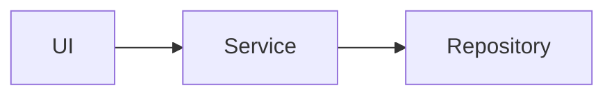
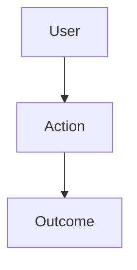

# {{PROJECT_NAME}} - Architecture

## System Overview

{{SYSTEM_OVERVIEW_DESCRIPTION}}

```
{{SYSTEM_DIAGRAM}}
```

## Architecture Diagram Applicability

> Decide diagram depth from brainstorm complexity signals. Do not force all six as detailed by default.

- **Complexity**: {{ARCH_COMPLEXITY_LEVEL}}  <!-- simple | moderate | complex -->
- **Services/Modules signal**: {{ARCH_SIGNAL_SERVICES}}
- **Event-driven signal**: {{ARCH_SIGNAL_EVENTS}}
- **Deployment signal**: {{ARCH_SIGNAL_DEPLOYMENT}}
- **User-flow signal**: {{ARCH_SIGNAL_USER_FLOWS}}
- **Integration signal**: {{ARCH_SIGNAL_INTEGRATIONS}}

| Diagram type | Status (`required|optional|N/A`) | Reason |
|--------------|----------------------------------|--------|
| system-overview | {{DIAGRAM_STATUS_SYSTEM_OVERVIEW}} | {{DIAGRAM_REASON_SYSTEM_OVERVIEW}} |
| data-flow | {{DIAGRAM_STATUS_DATA_FLOW}} | {{DIAGRAM_REASON_DATA_FLOW}} |
| event-flows | {{DIAGRAM_STATUS_EVENT_FLOWS}} | {{DIAGRAM_REASON_EVENT_FLOWS}} |
| module-dependencies | {{DIAGRAM_STATUS_MODULE_DEPENDENCIES}} | {{DIAGRAM_REASON_MODULE_DEPENDENCIES}} |
| deployment | {{DIAGRAM_STATUS_DEPLOYMENT}} | {{DIAGRAM_REASON_DEPLOYMENT}} |
| user-use-case | {{DIAGRAM_STATUS_USER_USE_CASE}} | {{DIAGRAM_REASON_USER_USE_CASE}} |

## Services

{{#SERVICES}}
### {{SERVICE_NAME}}
- **Purpose**: {{SERVICE_PURPOSE}}
- **Inputs**: {{SERVICE_INPUTS}}
- **Outputs**: {{SERVICE_OUTPUTS}}
- **Dependencies**: {{SERVICE_DEPENDENCIES}}
- **API**: {{SERVICE_API_TYPE}}
- **Scaling**: {{SERVICE_SCALING}}
{{/SERVICES}}

## Data Flow

```
{{DATA_FLOW_DIAGRAM}}
```

### Event Flows

- **Status**: {{DIAGRAM_STATUS_EVENT_FLOWS}}
- **Not applicable rationale**: {{DIAGRAM_NA_EVENT_FLOWS}}


### Module Dependencies

- **Status**: {{DIAGRAM_STATUS_MODULE_DEPENDENCIES}}
- **Not applicable rationale**: {{DIAGRAM_NA_MODULE_DEPENDENCIES}}



### User Use-Case Flows

- **Status**: {{DIAGRAM_STATUS_USER_USE_CASE}}
- **Not applicable rationale**: {{DIAGRAM_NA_USER_USE_CASE}}



## Integration Points

| Service A | Service B | Protocol | Endpoint/Topic |
|-----------|-----------|----------|----------------|
{{INTEGRATION_POINTS}}

## Technology Decisions

| Decision | Choice | Rationale | Alternatives Considered |
|----------|--------|-----------|------------------------|
{{TECHNOLOGY_DECISIONS}}

## Database Architecture

### Primary Database
- **Type**: {{DB_TYPE}}
- **Purpose**: {{DB_PURPOSE}}

### Cache
- **Type**: {{CACHE_TYPE}}
- **Purpose**: {{CACHE_PURPOSE}}

## Security Architecture

### Authentication
{{AUTH_DESCRIPTION}}

### Authorization
{{AUTHZ_DESCRIPTION}}

## Deployment Architecture

```
{{DEPLOYMENT_DIAGRAM}}
```

- **Status**: {{DIAGRAM_STATUS_DEPLOYMENT}}
- **Not applicable rationale**: {{DIAGRAM_NA_DEPLOYMENT}}

## Monitoring & Observability

- **Logging**: {{LOGGING_SOLUTION}}
- **Metrics**: {{METRICS_SOLUTION}}
- **Tracing**: {{TRACING_SOLUTION}}
- **Alerting**: {{ALERTING_SOLUTION}}
